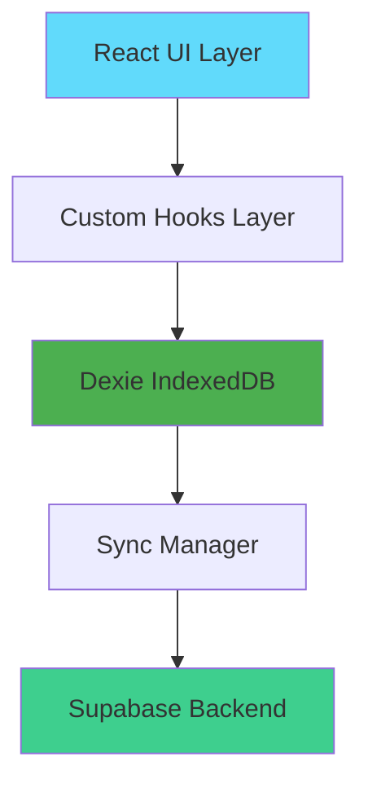
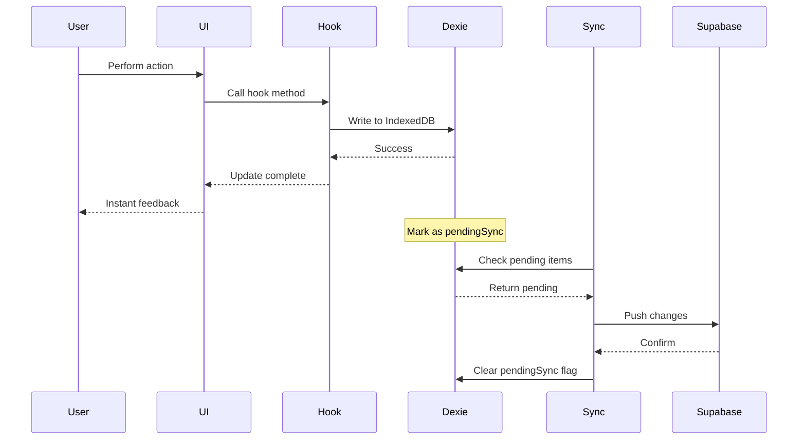
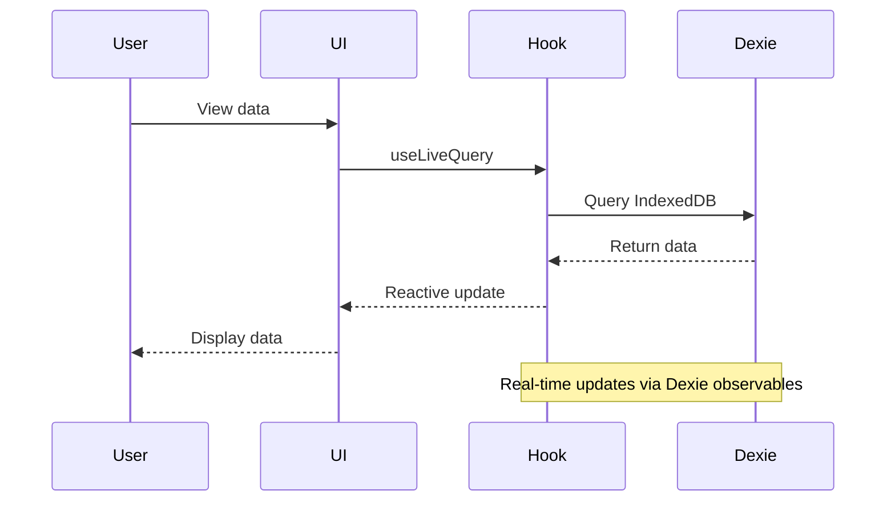
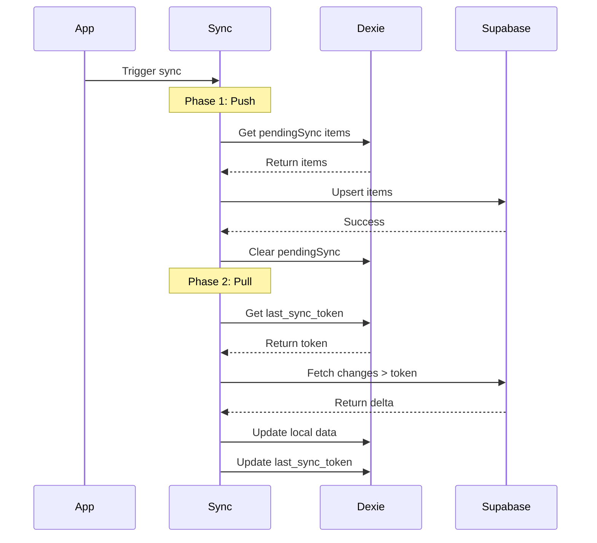
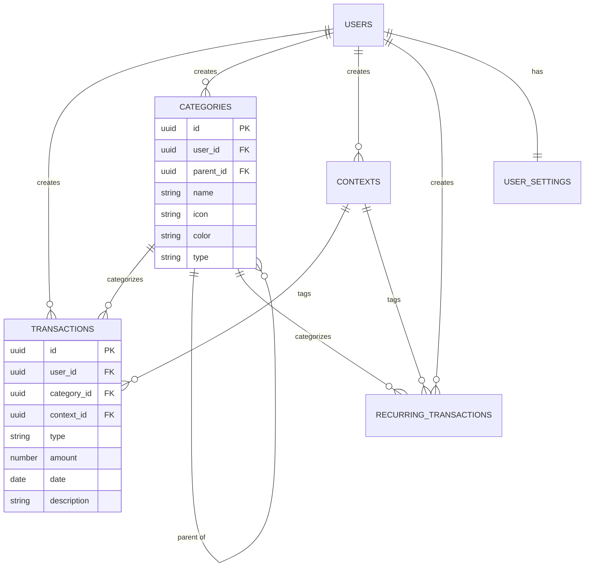

# Architecture Guide

This document provides a detailed technical overview of the Personal Expense Tracker PWA architecture, design patterns, and implementation details.

## Table of Contents

- [System Architecture](#system-architecture)
- [Offline-First Architecture](#offline-first-architecture)
- [Data Flow](#data-flow)
- [Database Schema](#database-schema)
- [Synchronization Strategy](#synchronization-strategy)
- [Component Architecture](#component-architecture)
- [State Management](#state-management)
- [PWA Implementation](#pwa-implementation)
- [Internationalization](#internationalization)

## System Architecture

### High-Level Overview

The application follows an **offline-first architecture** where all data operations happen locally first, then sync to the cloud when connectivity is available.



### Architecture Layers

1. **Presentation Layer** - React components and pages
2. **Business Logic Layer** - Custom hooks for data operations
3. **Data Access Layer** - Dexie for IndexedDB operations
4. **Synchronization Layer** - Sync manager for cloud sync
5. **Backend Layer** - Supabase (PostgreSQL + Auth)

## Offline-First Architecture

### Core Principles

1. **Local-First Operations**: All CRUD operations write to IndexedDB immediately
2. **Optimistic Updates**: UI updates instantly without waiting for server
3. **Background Sync**: Changes sync to Supabase when online
4. **Conflict Resolution**: Server state always wins (last-write-wins with sync tokens)

### Why Offline-First?

- **Performance**: Instant UI updates, no network latency
- **Reliability**: Works without internet connection
- **User Experience**: No loading spinners for basic operations
- **Data Ownership**: User data stored locally first

## Data Flow

### Write Operations (Create/Update/Delete)



### Read Operations



### Sync Operations



## Database Schema

### IndexedDB Schema (Dexie)

The local database uses Dexie.js as a wrapper around IndexedDB.

#### Transactions Table
```typescript
interface Transaction {
    id: string;              // UUID
    user_id: string;         // User identifier
    category_id: string;     // Required category reference
    context_id?: string;     // Optional context reference
    type: 'income' | 'expense' | 'investment';
    amount: number;          // Transaction amount
    date: string;            // ISO date string
    year_month: string;      // Computed: YYYY-MM for indexing
    description: string;     // Transaction description
    deleted_at?: string;     // Soft delete timestamp
    pendingSync?: number;    // 1 if needs sync, 0 if synced
    sync_token?: number;     // Server sync token
}

// Indexes: id, user_id, category_id, context_id, type, date, year_month, pendingSync, deleted_at
```

#### Categories Table
```typescript
interface Category {
    id: string;
    user_id: string;
    name: string;
    icon: string;            // Lucide icon name
    color: string;           // Tailwind color name
    type: 'income' | 'expense' | 'investment';
    parent_id?: string;      // For hierarchical categories
    active: number;          // 1 or 0 (boolean)
    deleted_at?: string;
    pendingSync?: number;
    sync_token?: number;
}

// Indexes: id, user_id, type, pendingSync, deleted_at
```

#### Contexts Table
```typescript
interface Context {
    id: string;
    user_id: string;
    name: string;
    description?: string;
    active: number;
    deleted_at?: string;
    pendingSync?: number;
    sync_token?: number;
}

// Indexes: id, user_id, pendingSync, deleted_at
```

#### Recurring Transactions Table
```typescript
interface RecurringTransaction {
    id: string;
    user_id: string;
    type: 'income' | 'expense' | 'investment';
    category_id: string;
    context_id?: string;
    amount: number;
    description: string;
    frequency: 'daily' | 'weekly' | 'monthly' | 'yearly';
    start_date: string;
    end_date?: string;
    active: number;
    last_generated?: string; // Last time transactions were generated
    deleted_at?: string;
    pendingSync?: number;
    sync_token?: number;
}

// Indexes: id, user_id, type, frequency, pendingSync, deleted_at
```

#### User Settings Table
```typescript
interface Setting {
    user_id: string;         // Primary key
    currency: string;        // e.g., 'EUR', 'USD'
    language: string;        // e.g., 'en', 'it'
    theme: string;           // 'light', 'dark', 'system'
    accentColor: string;     // Tailwind color name
    start_of_week: string;   // 'monday' or 'sunday'
    default_view: string;    // 'list' or 'grid'
    include_investments_in_expense_totals: boolean;
    cached_month?: number;   // Currently cached month for statistics
    last_sync_token?: number;// Last synced token
    updated_at?: string;
}

// Primary key: user_id
```

### Supabase Schema (PostgreSQL)

The Supabase schema mirrors the IndexedDB schema with additional features:

- **Row Level Security (RLS)**: Users can only access their own data
- **Triggers**: Automatically update `sync_token` and `updated_at` on changes
- **Foreign Keys**: Enforce referential integrity
- **Sequences**: Global sync token sequence for delta sync

See [supabase_schema.sql](file:///Users/ilariopc/Code/react/pwa-antigravity/supabase_schema.sql) for the complete schema.

### Entity Relationships



## Synchronization Strategy

### Delta Sync with Sync Tokens

The app uses **delta synchronization** to minimize data transfer and improve performance.

#### How It Works

1. **Sync Token**: Each table row has a `sync_token` (incrementing integer)
2. **Last Sync Token**: Client stores the last synced token in `user_settings`
3. **Delta Query**: Client requests only rows with `sync_token > last_sync_token`
4. **Update Local**: Client updates local database with delta
5. **Update Token**: Client updates `last_sync_token` to the highest received token

#### Sync Manager Implementation

Located in [src/lib/sync.ts](file:///Users/ilariopc/Code/react/pwa-antigravity/src/lib/sync.ts):

```typescript
class SyncManager {
    async sync() {
        await this.pushPending(userId);  // Push local changes
        await this.pullDelta(userId);    // Pull server changes
    }
    
    private async pushPending(userId: string) {
        // Find all items with pendingSync = 1
        // Upsert to Supabase
        // Clear pendingSync flag on success
    }
    
    private async pullDelta(userId: string) {
        // Get last_sync_token from settings
        // Query Supabase for sync_token > last_sync_token
        // Update local IndexedDB
        // Update last_sync_token
    }
}
```

#### Conflict Resolution

- **Strategy**: Last-write-wins (server state wins)
- **Rationale**: Single-user app, conflicts are rare
- **Future**: Could implement CRDTs for multi-device scenarios

### Sync Triggers

Synchronization happens in three scenarios:

1. **Manual Sync**: User clicks sync button in settings
2. **Auto Sync on Online**: When app detects internet connection restored
3. **Periodic Sync**: Could be added with service worker (not implemented)

## Component Architecture

### Component Hierarchy

```
App
├── ThemeProvider
├── Router
│   ├── AuthPage (public)
│   └── ProtectedRoute
│       └── AppShell
│           ├── DesktopNav / MobileNav
│           └── Routes
│               ├── Dashboard
│               ├── Transactions
│               ├── RecurringTransactions
│               ├── Categories
│               ├── Contexts
│               ├── Statistics
│               └── Settings
```

### Key Components

#### AppShell
- Provides layout structure
- Renders navigation (mobile/desktop)
- Wraps all authenticated pages

#### CategorySelector
- Complex component for hierarchical category selection
- Desktop: Breadcrumb navigation in popover
- Mobile: Sheet with nested navigation
- Filters by transaction type

#### TransactionList
- Displays transactions with virtual scrolling
- Shows sync status indicators
- Supports filtering and sorting

### UI Components (shadcn/ui)

Located in [src/components/ui/](file:///Users/ilariopc/Code/react/pwa-antigravity/src/components/ui/):

- Form components: Button, Input, Select, Switch, etc.
- Layout: Card, Dialog, Sheet, Tabs, ScrollArea
- Feedback: Alert, Toast (Sonner)
- Data: Table, Chart (Recharts integration)

## State Management

### Strategy: Local-First with Reactive Queries

The app uses **Dexie's `useLiveQuery`** for reactive state management:

```typescript
// Automatically re-renders when data changes
const transactions = useLiveQuery(
    () => db.transactions
        .where('user_id').equals(userId)
        .and(t => !t.deleted_at)
        .toArray()
);
```

### Benefits

- **No Redux/Zustand needed**: Database is the source of truth
- **Automatic updates**: Components re-render on data changes
- **Optimistic UI**: Changes reflect immediately
- **Simple mental model**: Query database, get reactive data

### Custom Hooks Pattern

Each entity has a custom hook that encapsulates:

1. **Data queries** with `useLiveQuery`
2. **CRUD operations** that write to IndexedDB
3. **Pending sync marking** for offline changes

Example: [useTransactions](file:///Users/ilariopc/Code/react/pwa-antigravity/src/hooks/useTransactions.ts)

## PWA Implementation

### Service Worker

Configured via [vite-plugin-pwa](file:///Users/ilariopc/Code/react/pwa-antigravity/vite.config.ts):

```typescript
VitePWA({
    registerType: 'autoUpdate',
    workbox: {
        runtimeCaching: [
            {
                // Cache documents, scripts, styles
                urlPattern: ({ request }) => 
                    request.destination === 'document' || 
                    request.destination === 'script' || 
                    request.destination === 'style',
                handler: 'NetworkFirst',  // Try network, fallback to cache
                options: {
                    cacheName: 'static-resources',
                    expiration: { maxAgeSeconds: 7 * 24 * 60 * 60 }
                }
            },
            {
                // Cache images
                urlPattern: ({ request }) => request.destination === 'image',
                handler: 'CacheFirst',  // Use cache, update in background
                options: {
                    cacheName: 'images',
                    expiration: { maxAgeSeconds: 30 * 24 * 60 * 60 }
                }
            }
        ]
    }
})
```

### Caching Strategies

- **NetworkFirst**: For HTML, CSS, JS - Fresh content when online
- **CacheFirst**: For images - Fast loading, update in background

### Manifest

PWA manifest defines:
- App name and icons
- Display mode: `standalone` (no browser UI)
- Theme colors
- Start URL

### iOS Compatibility

Special meta tags in [index.html](file:///Users/ilariopc/Code/react/pwa-antigravity/index.html):

```html
<meta name="viewport" content="width=device-width, initial-scale=1.0, maximum-scale=1.0, user-scalable=no">
<meta name="apple-mobile-web-app-capable" content="yes">
<meta name="apple-mobile-web-app-status-bar-style" content="default">
```

## Internationalization

### i18n Setup

Using [i18next](file:///Users/ilariopc/Code/react/pwa-antigravity/src/i18n.ts):

```typescript
i18n
    .use(LanguageDetector)      // Auto-detect browser language
    .use(initReactI18next)      // React integration
    .init({
        resources: {
            en: { translation: enTranslation },
            it: { translation: itTranslation }
        },
        fallbackLng: 'en'
    });
```

### Translation Files

Located in [src/locales/](file:///Users/ilariopc/Code/react/pwa-antigravity/src/locales/):

```
locales/
├── en/
│   └── translation.json
└── it/
    └── translation.json
```

### Usage in Components

```typescript
import { useTranslation } from 'react-i18next';

function MyComponent() {
    const { t } = useTranslation();
    return <h1>{t('dashboard.title')}</h1>;
}
```

### Language Switching

User can change language in Settings, which updates:
1. `i18n.changeLanguage()`
2. Local storage (persisted)
3. User settings in database

## Performance Optimizations

### IndexedDB Indexing

Strategic indexes on frequently queried fields:
- `year_month` for monthly transaction queries
- `type` for filtering by transaction type
- `pendingSync` for sync operations
- `deleted_at` for soft delete filtering

### Virtual Scrolling

Large lists use `ScrollArea` for performance with many items.

### Memoization

Statistics calculations use `useMemo` to avoid recalculation:

```typescript
const monthlyTotals = useMemo(() => {
    // Expensive calculation
    return calculateTotals(transactions);
}, [transactions]);
```

### Code Splitting

React Router automatically code-splits routes for faster initial load.

## Security Considerations

### Row Level Security (RLS)

Supabase policies ensure data isolation:

```sql
create policy "Users can view their own transactions"
    on public.transactions for select
    using (auth.uid() = user_id);
```

### Authentication

- Supabase Auth handles authentication
- JWT tokens stored securely
- Protected routes check auth state

### Data Validation

- TypeScript provides compile-time type safety
- Database constraints enforce data integrity
- Form validation prevents invalid input

## Future Enhancements

Potential architectural improvements:

1. **Optimistic Conflict Resolution**: Implement CRDTs for better multi-device sync
2. **Background Sync API**: Use service worker for periodic sync
3. **Incremental Sync**: Sync only changed fields, not entire rows
4. **Compression**: Compress sync payloads for large datasets
5. **Encryption**: End-to-end encryption for sensitive data
6. **Real-time Updates**: WebSocket for instant cross-device sync

---

This architecture provides a solid foundation for a reliable, performant, offline-first financial tracking application.
